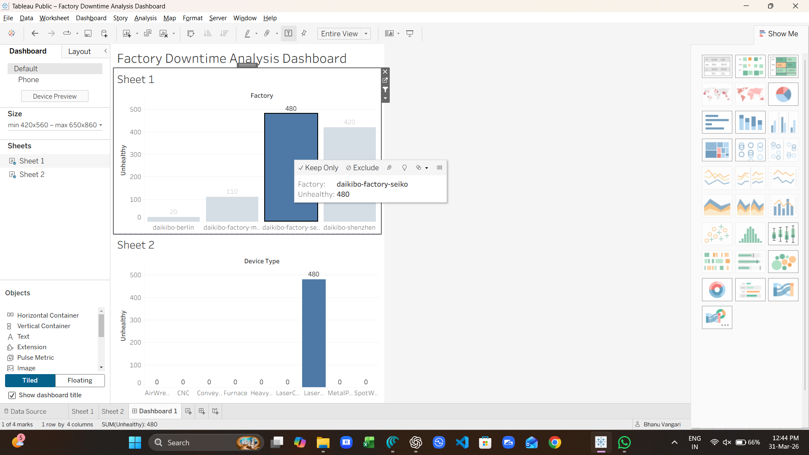

# 🏭 Factory Downtime Analysis Dashboard

## 📌 Project Overview

This project analyzes factory downtime data to identify key factors affecting production efficiency. The goal is to uncover patterns, reduce downtime, and support data-driven decision-making.

---

## 🎯 Objectives

* Identify major causes of downtime
* Analyze trends across time and departments
* Improve operational efficiency
* Build a clear and interactive dashboard

---

## 🛠️ Tools Used

* Microsoft Excel
* SQL
* Tableau / Power BI

---

## 📊 Key Insights

* 🔹 Major downtime caused by machine breakdowns
* 🔹 Peak downtime observed during specific shifts
* 🔹 Certain departments contribute more to downtime
* 🔹 Opportunities identified for process improvement

---

## 📈 Dashboard Features

* KPI Metrics (Total Downtime, Average Downtime)
* Trend Analysis (Monthly / Weekly)
* Department-wise breakdown
* Interactive filters

---

## 📷 Dashboard Preview

---

## 📁 Project Files

* `daikibo-telemetry-data.json` – Dataset
* `dashboard.png` – Dashboard image

---

## 💡 Skills Demonstrated

* Data Cleaning
* Data Analysis
* Data Visualization
* Business Insights

---

## 🚀 Future Improvements

* Predictive analysis for downtime
* Real-time dashboard integration
* Automation of reporting

---

## 🙌 Author

**Bhanu Vangari**
Aspiring Data Analyst 🚀
